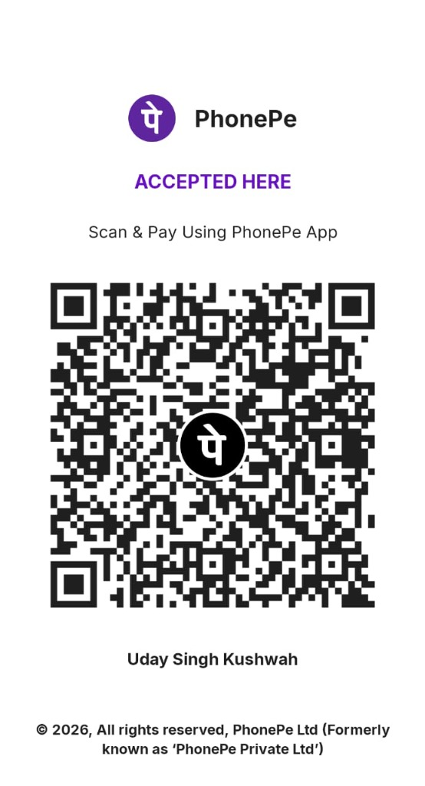

# AI Agent Suite

> **5 specialized AI agents** built with LangChain, LangGraph & LangSmith — all powered by Anthropic Claude.

    

---

## 🤖 Agents

| # | Agent | Description | LangGraph Pattern |
|---|-------|-------------|-------------------|
| 1 | 🔍 **Research Assistant** | Multi-source research → structured report | Sequential pipeline |
| 2 | 💬 **Conversational Chatbot** | Multi-turn memory chat + tools | Looping graph w/ MemorySaver |
| 3 | 🧑‍💼 **Customer Support** | RAG-powered with escalation routing | Sequential + conditional edges |
| 4 | 🛠️ **Code Review** | Static analysis + AI review pipeline | Sequential multi-analyzer |
| 5 | ⚡ **General ReAct** | Flexible ReAct agent with 6 tools | Standard ReAct loop |

---

## 🚀 Quick Start

### 1. Clone & Install

```bash
cd ai-agent-suite
pip install -r requirements.txt
```

### 2. Configure API Keys

```bash
cp .env.example .env
# Edit .env and fill in your keys
```

Required keys:
- `ANTHROPIC_API_KEY` — [console.anthropic.com](https://console.anthropic.com)
- `LANGCHAIN_API_KEY` — [smith.langchain.com](https://smith.langchain.com) (free tier available)

Optional:
- `TAVILY_API_KEY` — [app.tavily.com](https://app.tavily.com) (better search; falls back to DuckDuckGo)

### 3. Run the Dashboard

```bash
streamlit run app.py
```

Open http://localhost:8501 in your browser.

---

## 🗂️ Project Structure

```
ai-agent-suite/
├── .env.example              # Environment variable template
├── requirements.txt          # Python dependencies
├── app.py                    # Streamlit dashboard (main entry point)
│
├── config/
│   └── settings.py           # LLM factory, system prompts, shared config
│
├── tools/
│   ├── search_tools.py       # Web search (Tavily/DuckDuckGo) + Wikipedia
│   ├── code_tools.py         # Syntax analysis, pylint, security scan, complexity
│   └── rag_tools.py          # ChromaDB vector store + RAG retrieval
│
└── graphs/
    ├── research_graph.py     # Research: Plan→Search→Summarize→Report
    ├── chatbot_graph.py      # Chat: Memory-aware conversation loop
    ├── support_graph.py      # Support: Intent→RAG→Answer→Escalate
    ├── code_graph.py         # Review: Syntax→Lint→Security→Complexity→AI→Report
    └── general_graph.py      # ReAct: Think→Act→Observe loop
```

---

## 🔍 LangSmith Tracing

Every agent run is automatically traced. View your traces at **[smith.langchain.com](https://smith.langchain.com)** under the project `ai-agent-suite`.

You'll see:
- Full execution timeline for each run
- Individual node/step latencies
- All LLM calls with tokens and cost
- Tool invocations and their outputs
- Error traces for debugging

---

## 🧪 Test Agents Individually

```bash
# Research Agent
python graphs/research_graph.py

# Chatbot (interactive REPL)
python graphs/chatbot_graph.py

# Customer Support
python graphs/support_graph.py

# Code Review
python graphs/code_graph.py

# General ReAct Agent
python graphs/general_graph.py
```

---

## 📦 Tech Stack

| Component | Technology |
|-----------|-----------|
| LLM | Anthropic Claude (claude-3-5-sonnet-20241022) |
| Orchestration | [LangGraph](https://langchain-ai.github.io/langgraph/) 0.2.x |
| Tools & Chains | [LangChain](https://python.langchain.com/) 0.3.x |
| Observability | [LangSmith](https://smith.langchain.com/) |
| Vector Store | ChromaDB (local) |
| Embeddings | sentence-transformers (all-MiniLM-L6-v2) |
| Web Search | Tavily / DuckDuckGo |
| Dashboard | Streamlit |

---

## 📄 License

MIT License — feel free to use and extend!

---

## ☕ Support

If you find this project helpful, consider buying me a coffee! Scan the QR code below:

<p align="left">
  
</p>
